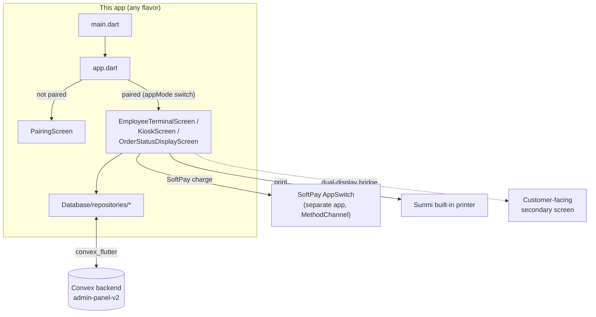
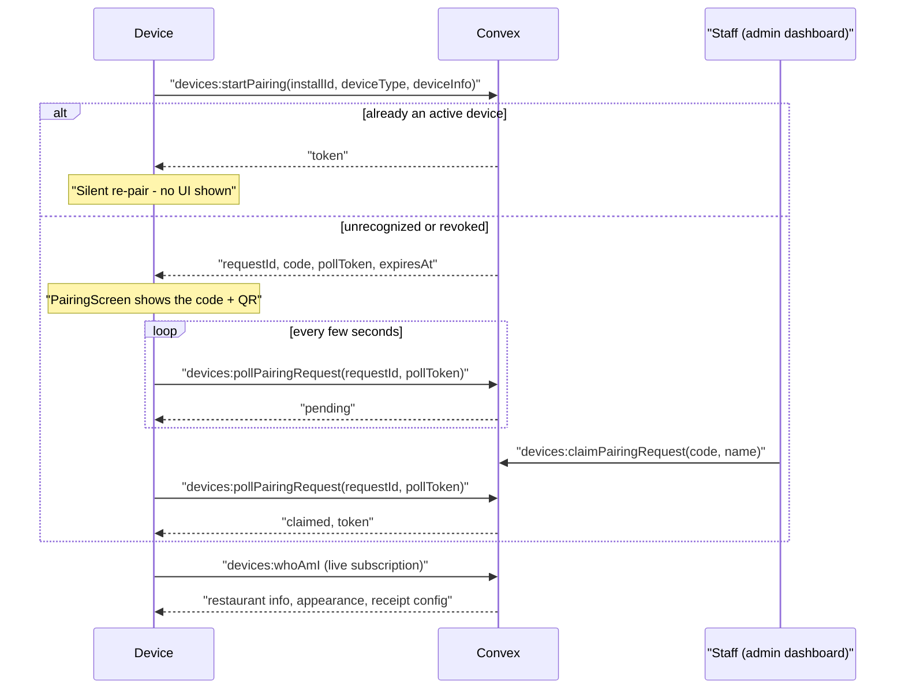
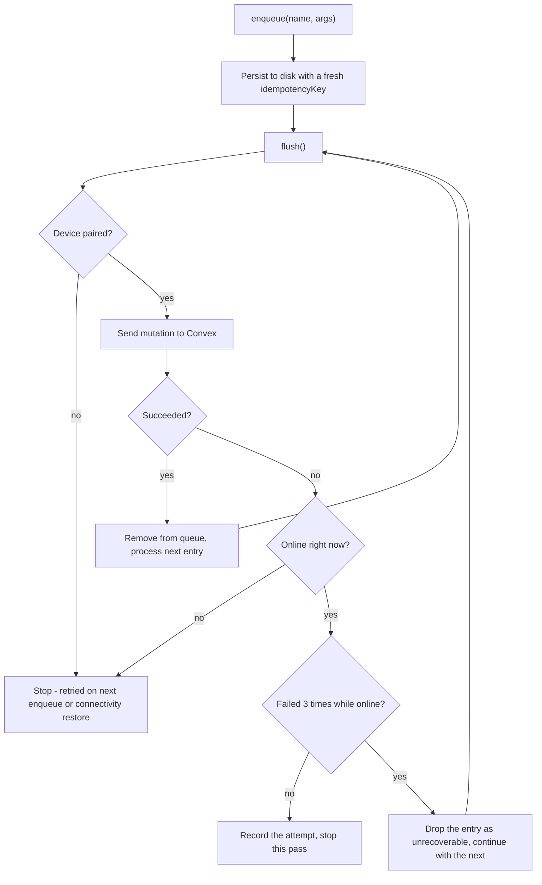
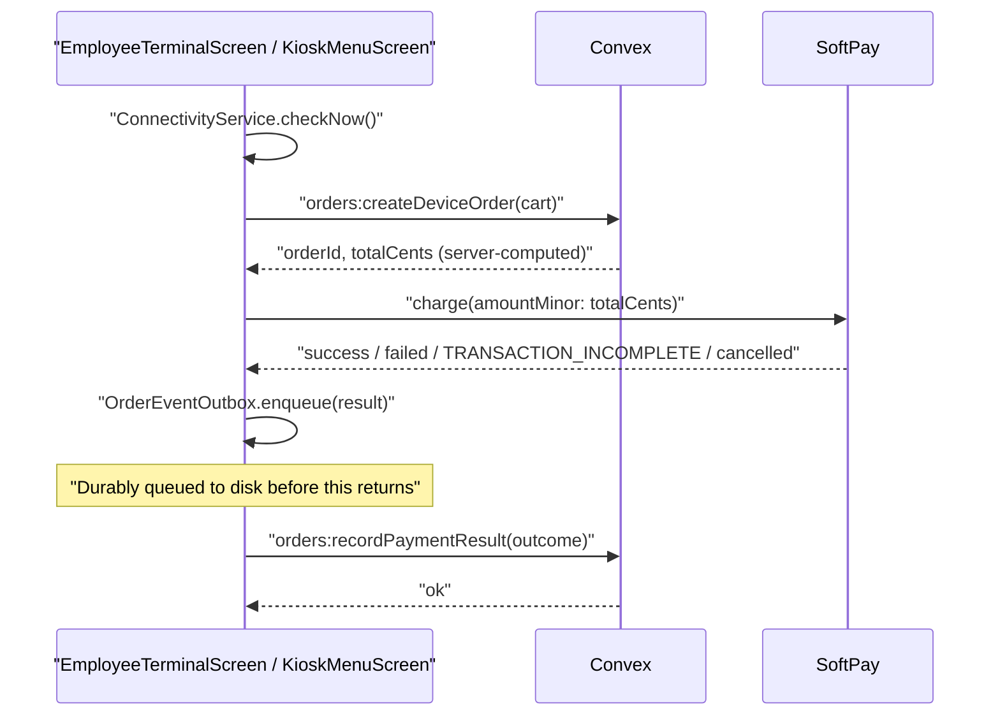

# NorrOne POS — Flutter apps

One Flutter codebase, **three build flavors**, one Convex backend. This
README is a deep-reference map of the codebase: what every file does, how
the pieces fit together, and where to look first when something breaks.
For the Convex backend itself, see
`../convex_main/admin-panel-v2/README.md` and
`../convex_main/admin-panel-v2/DEVICE_REGISTRATION_README.md`.

## Table of contents

1. [The three apps](#1-the-three-apps)
2. [Architecture at a glance](#2-architecture-at-a-glance)
3. [App boot & routing](#3-app-boot--routing) — `main.dart`, `app.dart`, `Core/`
4. [Device identity & pairing](#4-device-identity--pairing) — `Database/device_identity_service.dart`, `pairing_screen.dart`
5. [Data layer](#5-data-layer) — `Database/repositories/`, `Database/models/`
6. [POS — Employee Terminal](#6-pos--employee-terminal)
7. [POS — Customer-facing secondary display](#7-pos--customer-facing-secondary-display)
8. [POS — Settings](#8-pos--settings)
9. [Kiosk](#9-kiosk)
10. [Order Status Display](#10-order-status-display)
11. [Shared widgets](#11-shared-widgets)
12. [Theming](#12-theming)
13. [SoftPay payment integration](#13-softpay-payment-integration)
14. [Printing](#14-printing)
15. [Debugging index — symptom → file](#15-debugging-index--symptom--file)
16. [Build setup & known issues](#16-build-setup--known-issues)

---

## 1. The three apps

One codebase, one `lib/main.dart` entrypoint, three Android **product
flavors** (`android/app/build.gradle.kts`) selected at build time via
`--flavor` + `--dart-define=APP_MODE=...`. `lib/Core/app_mode.dart` reads
that define into a single `appMode` constant everything else branches on.

| Flavor | `APP_MODE` | Hardware | Screen it boots into | Orientation |
|---|---|---|---|---|
| `pos` | `pos` | Sunmi D3 mini (or any Android device + Softpay app) | `EmployeeTerminalScreen` | Landscape |
| `kiosk` | `kiosk` | Sunmi Flex 3 (self-service) | `KioskScreen` | Portrait |
| `display` | `display` | Any plain Android display/tablet | `OrderStatusDisplayScreen` | Landscape |

```bash
flutter run   --flavor pos     --dart-define=APP_MODE=pos     -t lib/main.dart
flutter run   --flavor kiosk   --dart-define=APP_MODE=kiosk   -t lib/main.dart
flutter run   --flavor display --dart-define=APP_MODE=display -t lib/main.dart

# swap `run` for `build apk` to produce a release build
```

All three share every line of Dart code — the flavor only changes which
screen `app.dart` shows after pairing, the orientation lock, and the
Android `applicationIdSuffix`/app name.

---

## 2. Architecture at a glance



Every screen talks to Convex through the repositories in
`lib/Database/repositories/`, never directly through `convex_flutter`.
Every device (regardless of flavor) goes through the same pairing
handshake in section 4 before it can reach its home screen at all.

---

## 3. App boot & routing

| File | Role |
|---|---|
| `lib/main.dart` | Process entrypoint. Locks orientation per `appMode`, initializes the Convex client (`AppConvexClient.initialize`), starts `ConnectivityService` and `OrderEventOutbox` (both process-wide singletons that must be running before any screen builds), then `runApp(const App())`. Also imports `customer_display_main.dart` for a side effect only — see §7. |
| `lib/app.dart` | The root `MaterialApp`. Listens to `ThemeController` (light/dark + accent) and `DeviceIdentityService.isPairedNotifier`: unpaired → `PairingScreen`; paired → whichever screen `appMode` maps to. Keys the subtree on `isPaired` so a mid-session revocation tears down the whole screen (and any pushed routes) rather than trying to patch it in place. |
| `lib/Core/app_mode.dart` | The single `const appMode = String.fromEnvironment('APP_MODE', ...)` everything else reads. |
| `lib/Core/navigation/route_observer.dart` | One shared `RouteObserver` registered on the `MaterialApp` so screens can use `RouteAware.didPopNext` (used by `EmployeeTerminalScreen` to re-unfocus its own `FocusScopeNode` when returning from Orders/Settings). |
| `lib/Core/connectivity/connectivity_service.dart` | `ConnectivityService.instance` — process-wide `ValueNotifier<bool> isOnline`, combining OS-level interface-change events with a periodic real HTTP reachability probe (an interface can say "connected" with no working path to the internet). `checkNow()` is also called explicitly right before every charge attempt, layered on top of the continuous background monitoring. |
| `lib/Database/convex_client.dart` | `AppConvexClient` — one `ConvexClient.initialize(...)` call, pointed at the `admin-panel-v2` deployment. Override the URL per build with `--dart-define=CONVEX_URL=...`. |

---

## 4. Device identity & pairing

**Every device of every flavor must pair before it can do anything.**
There is deliberately **no offline fallback** — a device that can't reach
Convex sits on `PairingScreen`'s "Device offline — retrying…" state
forever rather than pretending to be usable. See
`../convex_main/admin-panel-v2/DEVICE_REGISTRATION_README.md` for the
Convex side of this.



| File | Role |
|---|---|
| `lib/Database/device_identity_service.dart` | `DeviceIdentityService.instance` — the single owner of this device's pairing lifecycle. `bootstrap()` calls `devices:startPairing` with a locally-generated, disk-persisted `installId` (the *only* thing persisted across restarts — the device **token** is never saved, so a revoked device is forced to re-pair on its next launch instead of silently limping along on a dead token). Returns `null` if already paired (silent), or a `PairingChallenge` (6-digit code + QR) for `PairingScreen` to show. Also owns a live `devices:whoAmI` subscription that flips `isPairedNotifier` back to `false` the instant staff revokes the device mid-session, and caches receipt/appearance/kiosk-media config from that same response (see `remoteConfigVersion`). |
| `lib/Database/pairing_screen.dart` | `PairingScreen` — drives the handshake UI. Shows a spinner while `bootstrap()` resolves; if it returns a challenge, shows the code + `QrImageView` and calls `waitForClaim()`, which polls `devices:pollPairingRequest` every few seconds until staff claims it from the admin dashboard. Any thrown error (network down, etc.) shows "Device offline — retrying…" and loops `bootstrap()` again after a delay — this is the **only** offline-handling behavior in the whole app, by design. |
| `lib/Database/repositories/device_repository.dart` | Thin Convex wrapper: `startPairing`, `pollPairingRequest`, `whoAmI`, `heartbeat`, `redeemSettingsUnlockCode`, `subscribeToStatus`. |
| `lib/Database/device_hardware.dart` | `collectDeviceInfo()` — best-effort manufacturer/model/OS version via `device_info_plus`, for display in the admin dashboard only, never a security/lookup key. |
| `lib/Database/models/device_info.dart` | `DeviceInfo`, `DeviceWhoAmI`, `PairingOutcome`, `PairingPollResult` — the wire shapes for everything in this section. |

**Settings-screen lock** (separate from device pairing, but lives in the
same service): `redeemSettingsUnlockCode` (online, staff generates a
short-lived code from the dashboard) and `verifyRecoveryCodeOffline`
(offline — hashes the entered code locally and compares against a cached
hash refreshed on every `whoAmI` call). See §8.

---

## 5. Data layer

`lib/Database/repositories/` — every one of these is a singleton
(`.instance`) wrapping `ConvexClient` calls. Screens never call
`ConvexClient` directly.

| File | Role |
|---|---|
| `menu_repository.dart` | `subscribeToMenu`/`fetchMenu`/`fetchPublicMenu`. The live subscription also disk-caches the last-seen menu (keyed by the device's stable `installId`, **not** the rotating token) purely as a fast first-paint on cold start — it is never a substitute for live data; if the live subscription itself fails, that failure is surfaced as-is, never masked by silently falling back to the cache. |
| `order_repository.dart` | `createOrder` (→ `orders:createDeviceOrder`, returns the **server-computed** `totalCents` — see the warning below), `recordPaymentSuccess`/`recordPaymentFailure`/`recordPaymentUnconfirmed`/`recordRefund`/`recordCancellation` (all routed through `OrderEventOutbox`, not called directly), `subscribeToOrders`. |
| `order_event_outbox.dart` | `OrderEventOutbox.instance` — a disk-backed retry queue for payment-result/refund/cancellation reports. Persists each report (with a fresh idempotency key) to `SharedPreferences` **before** attempting to send it, so an app kill or dropped connection between a successful SoftPay charge and the mutation reaching Convex can't lose the report — it's retried on the next connectivity-restore or `enqueue()` call. See the file's own doc comment for the full reasoning (including a documented, fixed lost-update race and stuck-queue bug from an earlier pass — read it before touching this file). |
| `cart_reconciliation.dart` | `reconcileCartWithMenu()` — drops any cart line whose item disappeared or went out of stock against a fresh live menu snapshot, called from both `EmployeeTerminalScreen` and `KioskMenuScreen`'s menu-subscription `onUpdate`. |
| `remote_asset_cache.dart` | `RemoteAssetCache.instance` — disk cache for restaurant-configured media (logos, kiosk background video), keyed by URL (a re-upload always gets a new URL, so no manual invalidation needed). Atomic write-then-rename so a process kill mid-download can't leave a corrupt cache entry. |

**`OrderEventOutbox.flush()` decision flow** — the part worth understanding
before touching this file:



`lib/Database/models/` — plain Dart classes with `fromJson`/`toJson`,
mirroring Convex's own shapes 1:1 (see each file's doc comment for exactly
which Convex table/query it mirrors): `menu_category.dart`,
`menu_item.dart`, `menu_item_addon.dart`, `order.dart`, `order_item.dart`,
`order_payment_event.dart`, `transaction_snapshot.dart`,
`cart_entry.dart` (in-progress cart line, not Convex-mirrored — see
`toDeviceCartItem()` for the bridge), `device_cart_item.dart`,
`device_info.dart`.

> ⚠️ **Never compute a charge amount from the local cart.** `createOrder`
> re-derives `subtotalCents`/`discountCents`/`totalCents` server-side from
> live menu/addon/coupon data — that returned `totalCents` is what must be
> passed to `SoftPayService.charge()`. A local cart-sum-based charge amount
> was a real bug fixed in this codebase; see
> `../convex_main/admin-panel-v2/docs/superpowers/specs/2026-08-10-device-order-payment-integrity.md`
> for the full writeup.

---

## 6. POS — Employee Terminal

`lib/Feactures/POS/EmployeeTerminal/` — the cashier-facing screen.

**The charge flow** (identical in shape on the Kiosk side — see §9):



| File | Role |
|---|---|
| `employee_terminal_screen.dart` | The main screen: menu grid + search + category tabs, cart panel, order-type pills, and the whole `_charge()` flow (connectivity check → `createOrder` → `SoftPayService.charge()` → record result). Has a synchronous `_isChargeInFlight` guard set *before any `await`* to close a double-tap race that could otherwise fire two real charges — see the field's own doc comment before touching the charge flow. |
| `softpay_service.dart` | `SoftPayService.instance` — MethodChannel/EventChannel wrapper around the native SoftPay plugin. `charge`, `refund`, `cancelCharge`, `statusUpdates` stream. |
| `softpay_models.dart` | `PaymentStage`, `PaymentStatusUpdate`, `SoftPayException`, `TransactionResult`. |
| `softpay_transaction_mapper.dart` | `toTransactionSnapshot()` — bridges SoftPay's `TransactionResult` into the `TransactionSnapshot` shape Convex expects. |
| `error_state.dart` | **Read this before writing any error-facing UI.** `friendlyErrorMessage()` (generic exception → sentence), `friendlySoftPayMessage()`/`friendlySoftPayProcessingUpdate()` (SoftPay's SCREAMING_SNAKE_CASE codes → human phrases, with a curated table for every known code plus a generic humanizer fallback for anything new), `friendlyPrinterIssue()` (Sunmi printer status → sentence), plus the shared `ErrorState`/`EmptyState` widgets. |
| `printer_service.dart` | See §14. |
| `order_display_service.dart` | Pushes cart snapshots to the customer-facing secondary display over a native MethodChannel — see §7. |
| `orders_screen.dart` | Order history/management: live `subscribeToOrders`, filter chips (all/pending/paid/failed/refunded), refund flow (prompts an amount, charges it as its own new SoftPay transaction, then `recordRefund`), receipt reprinting. |

---

## 7. POS — Customer-facing secondary display

`lib/Feactures/POS/CustomerTerminal/` — runs on the Sunmi D3 mini's
**second screen**, as its own separate Flutter engine/isolate in the same
Android process.

| File | Role |
|---|---|
| `customer_display_main.dart` | `customerDisplayMain()` — the `@pragma('vm:entry-point')` Dart entrypoint the native side (`android/.../dualdisplay/CustomerDisplayActivity.kt`) invokes by name. **Deliberately never initializes a Convex client** — this engine only ever displays data relayed over the native bridge. `main.dart` on the primary engine imports this file purely so the entrypoint is included in the compiled kernel (native `DartExecutor` lookup fails otherwise); it is never called from Dart. |
| `customer_app.dart` | `CustomerDisplayApp` — its own `MaterialApp`, themed from its own `ThemeController` instance (same SharedPreferences, loaded independently — won't observe a *live* theme change on the primary engine, only whatever was set before this display started). |
| `customer_display_screen.dart` | Shows the live cart (from `CartUpdated` bridge events) or the charge animation (`_SecondaryPaymentPanel`, reusing `StageVisual`) when a `StartChargeRequested` event arrives. |
| `customer_display_bridge.dart` | `CustomerDisplayBridge.instance` — the native bridge client for *this* engine: receives `CartUpdated`/`StartChargeRequested`/`CancelChargeRequested` events, sends `reportStatus`/`reportResult`/`reportError` back. |

> ⚠️ **Known dead code, documented on purpose:** `CustomerDisplayScreen`
> can receive a `StartChargeRequested` event and has its own
> `SoftPayService.charge()` call — but nothing in the app can currently
> *send* that event (`OrderDisplayService` on the cashier side only
> exposes `pushCart`/`activateSecondaryDisplay`; the native plugin never
> implements a `startCharge` case). If this is ever wired up, order
> creation and `recordPaymentResult`/`recordRefund` must be driven from
> the **primary/cashier engine** (the only one with Convex access), not
> from this screen — wiring it naively would reintroduce a
> "charge-with-no-Convex-record" bug. Full detail in
> `../convex_main/admin-panel-v2/docs/superpowers/specs/2026-08-10-device-order-payment-integrity.md`.

---

## 8. POS — Settings

`lib/Feactures/POS/Settings/`

| File | Role |
|---|---|
| `settings_screen.dart` | Figma-matching left-nav + right-pane layout. Only "Appearance" is wired (read-only — appearance is one config per restaurant, set on the admin dashboard and applied live via `ThemeController.applyRemote`); the rest are disabled "coming soon" placeholders. |
| `settings_lock_gate.dart` | `SettingsLockGate` — wraps `SettingsScreen`, re-locks every time it's rebuilt (not persisted across navigations). Two unlock paths: **online** (short-lived staff-generated code, `devices:redeemSettingsUnlockCode`) or **offline recovery** (long-lived code, verified purely against a locally cached hash, zero network calls). |

---

## 9. Kiosk

`lib/Feactures/Kiosk/` — the self-service ordering flow (Sunmi Flex 3,
portrait). No menu/cart logic lives in `KioskScreen` itself — that's all
`KioskMenuScreen`.

| File | Role |
|---|---|
| `kiosk_screen.dart` | The idle/start screen: full-bleed looping background video (or a branded animated gradient fallback — see `kiosk_background_video.dart`), Dine In/Take Out pill buttons floating over it, and a solid white bar flush against the bottom edge with the English/Swedish language switcher (flag badge + text, no real localization wired up yet — display-only) and the `NorrSpectBlack` logo. |
| `kiosk_background_video.dart` | `KioskBackgroundVideo` — plays a manager-uploaded video (downloaded once via `RemoteAssetCache`, never re-fetched unless the URL changes) or falls back to `_FallbackBackground`, a slow animated gradient in the restaurant's accent color with the kiosk header logo centered on it. |
| `kiosk_menu_screen.dart` | The big one (~2000 lines): menu grid + category rail, cart view, checkout/payment panel, and the "Are you still there?" idle-reset prompt — all as one screen swapping between `_KioskView.menu`/`.cart` and a `_isCharging` overlay. Same `_isChargeInFlight` double-tap guard as the Employee Terminal (see §6) applies here too. The idle prompt (`_AreYouStillThereDialog`) blurs the background (`BackdropFilter`) and shows a circular countdown ring, not a plain sentence of text. |

**Kiosk menu screen internals worth knowing when debugging:**

- `_addToCart` — if the tapped item is already in the cart (any addon
  combo), reopens the addon sheet **pre-filled** with that combo's current
  addons/quantity and *replaces* that line on confirm, rather than always
  stacking a fresh addition. See the method's own comment for the
  merge/replace semantics when the user changes the addon combo mid-edit.
- `_KioskCartBar` — the bottom summary bar on the menu view. Shows a plain
  "N items" count (not item-photo avatars) and has its own background
  card, both changed from an earlier design that floated bare icons
  directly on the screen background.
- `_KioskCheckoutPanel`/`_PaymentMethodCard` — the payment stage UI,
  restyled to match the rest of the kiosk's button sizing (72px-tall
  primary buttons, consistent with the cart view) and theme-driven colors
  (`scheme.primary`, not a hardcoded accent constant — respects each
  restaurant's configured accent).

---

## 10. Order Status Display

`lib/Feactures/OrderStatusDisplay/order_status_display_screen.dart` — the
`display` flavor's only screen. A live two-column pickup board:
**Preparing** (`pending`/`cooking`/`packing`) on the left, **Ready** on
the right, oldest-first in each column. Shows nothing but each order's
`displayId` in large text — no items, no customer names, no timestamps,
deliberately minimal so it's readable from a few meters away. Subscribes
to the same `orders:listForDevice` feed every other flavor uses via
`OrderRepository.subscribeToOrders`. Purely read-only — this flavor never
mutates an order's status; that happens from the POS/kiosk or the admin
dashboard.

---

## 11. Shared widgets

`lib/Widgets/` — used across more than one feature folder.

| File | Role |
|---|---|
| `addon_picker_sheet.dart` | `showAddonPickerSheet()` — the bottom sheet for choosing an item's addons **and** quantity in one interaction (a quantity stepper lives in the sheet itself, so "3 with extra cheese" is one confirm tap, not three trips through the sheet or a second trip to the cart's own +/- stepper). Shows the item's photo top-center. Shared by POS and Kiosk. |
| `connectivity_banner.dart` | `ConnectivityBanner` — renders nothing while online; a red banner tied live to `ConnectivityService.isOnline` otherwise. |
| `dish_tile.dart` | `DishTile` — one card in the menu grid; photo, name, price, a cart-quantity badge, "Sold out" styling when unavailable. |
| `category_tab_bar.dart` | `CategoryTabBar` — controlled category-filter tabs. |
| `order_type_pills.dart` | `OrderTypePills` + the `OrderType` enum (`dineIn`/`toGo`/`delivery`) — mirrors `orders.orderType` in the backend schema. |
| `payment_status_panel.dart` | `PaymentStatusPanel` + `StageVisual` (the shared connecting/processing/approved/declined/cancelled animation — a pulsing tap-to-pay ring, a pop/shake icon) + `PaymentPanelStage` enum. Reused by the Employee Terminal, Customer Display, and (via its own local copy, `_KioskCheckoutPanel`) the Kiosk. |
| `powered_by_footer.dart` | `PoweredByFooter` — "Powered by NorrSpect" brand credit, light/dark logo variant picked from `surfaceBrightness`. |
| `app_header_bar.dart` | `AppHeaderBar` — Employee Terminal's top bar: logo, restaurant name, live date, search field. |
| `app_sidebar.dart` | `AppSidebar` — Employee Terminal's left icon rail (Home/Orders/secondary-display-connect/Settings wired; Messages/Notifications/Logout are "coming soon" placeholders). |

---

## 12. Theming

| File | Role |
|---|---|
| `lib/Core/theme/app_colors.dart` | Raw color tokens sampled from the Figma reference — the only file that should define a literal `Color(0x...)`. |
| `lib/Core/theme/app_theme.dart` | `buildAppTheme({brightness, accent})` — the **one** `ThemeData` builder both Flutter engines (primary + customer display) render from, so they always share one visual language. |
| `lib/Core/theme/theme_controller.dart` | `ThemeController.instance` — process-wide `ChangeNotifier` holding the current theme mode + accent. **Not locally editable/persisted** — appearance is one config per restaurant, pushed from the admin dashboard and applied via `applyRemote()` on every `whoAmI` response (including live, mid-session pushes). Kiosk defaults to light before its own config arrives (matches its storefront-style reference); every other flavor defaults to dark. |

---

## 13. SoftPay payment integration

Card payments (NFC, Apple/Google Pay) go through Softpay's **AppSwitch**
SDK — this app hands off to a separate Softpay app on the same device and
gets switched back with the result. Full SDK docs:
https://developer.softpay.io/sdk/

- **Native side**: `android/app/src/main/kotlin/.../softpay/`
  - `SoftPayClientProvider.kt` — builds the SDK `Integrator`/`Client` from
    `BuildConfig` values (see §16 for the required `local.properties` keys).
  - `SoftPayPlugin.kt` — `FlutterPlugin` exposing the
    `com.proxiestudio.kds_pos/softpay` MethodChannel (`readiness`,
    `charge`, `cancelCharge`) and `.../softpay/status` EventChannel for
    live processing updates.
- **Flutter side**: §6's `softpay_service.dart` + `softpay_models.dart`.
- **Error handling**: §6's `error_state.dart` — `TRANSACTION_INCOMPLETE`
  specifically means the SDK **could not determine** whether the charge
  succeeded; the UI wording for that code says "check" not "retry"
  because a blind retry risks double-charging. The corresponding Convex
  mutation records this as its own `"unconfirmed"` payment status, never
  coerced into paid or failed — see
  `../convex_main/admin-panel-v2/docs/superpowers/specs/2026-08-10-device-order-payment-integrity.md`.

Testing requires the **Softpay Sandbox app** installed and logged in on
the same physical device — real cards don't work in Sandbox; use the Visa
CDET test-card emulator or physical test cards.

---

## 14. Printing

`lib/Feactures/POS/EmployeeTerminal/printer_service.dart` —
`PrinterService.instance` talks to the Sunmi built-in printer via
`sunmi_flutter_plugin_printer`. `status()` returns a Sunmi `Status` name
(`READY`, `ERR_PAPER_OUT`, etc. — humanized by `friendlyPrinterIssue()` in
`error_state.dart`). `printReceipt(...)` prints the restaurant's logo
(scaled to preserve aspect ratio), header text, itemized lines, total,
card scheme + last 4 digits, and footer text — called from both
`EmployeeTerminalScreen` (fresh charge) and `OrdersScreen` (reprint from
history).

---

## 15. Debugging index — symptom → file

| Symptom | Start here |
|---|---|
| Device stuck on pairing / "Device offline" | `device_identity_service.dart`'s `bootstrap()`, `pairing_screen.dart` |
| Wrong/duplicate order numbers, or an order created twice | `order_repository.dart`'s `createOrder` idempotency key, backend `orders:createDeviceOrder` |
| Charge amount looks wrong | Confirm the charge call uses `result.totalCents` from `createOrder`, **not** a locally-summed cart total — see §5's warning |
| Payment succeeded but order still shows unpaid | `order_event_outbox.dart` — check whether the report is still queued (a permanently-failing entry is dropped after retries; see its own doc comment) |
| Menu item missing/stale in a cart | `cart_reconciliation.dart` |
| Raw SDK error code shown to a user | `error_state.dart` — add the code to `_knownSoftPayMessages`/`_knownPrinterMessages` |
| Double-charge from a fast double-tap | `_isChargeInFlight` in `employee_terminal_screen.dart`/`kiosk_menu_screen.dart` — must be set synchronously before the first `await` in `_charge()` |
| Theme/accent not matching the dashboard config | `theme_controller.dart`'s `applyRemote`, `device_identity_service.dart`'s `_applyWhoAmI` |
| Kiosk background video/logo not updating | `remote_asset_cache.dart` (keyed by URL — a re-upload must produce a new URL), `remoteConfigVersion` in `device_identity_service.dart` |
| Receipt printing fails or shows wrong logo | `printer_service.dart`, `DeviceIdentityService.logoBytes`/`receiptConfig` |
| Customer-facing secondary display shows nothing | `customer_display_main.dart`'s entrypoint registration, native `DisplayBridge.kt` — remember this engine never talks to Convex directly |
| Settings screen won't unlock | `settings_lock_gate.dart` — check which of the two unlock paths (online code vs. offline recovery hash) is being used |
| App connects fine but `ConnectivityBanner` still shows offline | `connectivity_service.dart` — the periodic HTTP probe, not just the OS interface-change event, is what actually flips `isOnline` |

---

## 16. Build setup & known issues

### SoftPay credentials (`android/local.properties`, gitignored)

```
SOFTPAY_MAVEN_URL=https://nexus.softpay.io/repository/softpay-integrator/
SOFTPAY_MAVEN_USERNAME=<Nexus username, from Softpay Support>
SOFTPAY_MAVEN_PASSWORD=<Nexus password, from Softpay Support>
SOFTPAY_INTEGRATOR_ID=<Integrator id, from Softpay Support - different for sandbox/production>
SOFTPAY_INTEGRATOR_SECRET=<Integrator secret, from Softpay Support>
SOFTPAY_MERCHANT_NAME=<your own label, not provided by Softpay - any non-blank string>
SOFTPAY_TARGET=sandbox   # sandbox | production | any
```

Read by `android/build.gradle.kts` (Maven repo credentials) and
`android/app/build.gradle.kts` (exposed as `BuildConfig` fields). Getting
real values is a one-time thing per organisation — email
**support@softpay.io** for Nexus + Integrator credentials and Sandbox app
access (via Firebase App Distribution).

Gradle notes specific to this SDK:
- `AndroidManifest.xml` declares a `manifest/queries` entry for
  `io.softpay.sandbox` (Android 11+ requirement to target the Sandbox
  app) — drop it if `SOFTPAY_TARGET` is ever switched to `production` only.
- `-Xjvm-default=all` is added to Kotlin `compilerOptions.freeCompilerArgs`
  — required by the SDK docs for its default-implemented Kotlin interface
  members to compile/link correctly.
- `SoftPayPlugin.kt` opts into
  `@OptIn(io.softpay.client.meta.DelicateSoftpayApi::class)` for
  `Request.abort(...)` (cancelling an in-flight charge).

### Convex deployment

Points at `admin-panel-v2`'s Convex deployment
(`https://glad-bear-64.eu-west-1.convex.cloud` by default — see
`lib/Database/convex_client.dart`). Override per build with
`--dart-define=CONVEX_URL=https://your-deployment.convex.cloud`. Backend
source lives in `../convex_main/admin-panel-v2/packages/backend/convex/`
— see that repo's own README/CLAUDE.md for how to run/deploy it.

### Known issue: `convex_flutter` 3.0.1 needs manual patches to build

This package uses a Rust FFI native layer (via `cargokit`). On this
project's Gradle version (9.1.0), building it fails out of the box for
two unrelated reasons. **These patches are applied directly to the local
pub cache, not vendored into this repo** — any new machine, teammate, or
CI runner needs to reapply them before `flutter build apk` will succeed.

Edit these two files inside
`~/.pub-cache/hosted/pub.dev/convex_flutter-3.0.1/`:

1. **`cargokit/gradle/plugin.gradle`** — Gradle 9 removed
   `Project.exec()`; use the injected `ExecOperations` service instead:
   - Add imports: `import javax.inject.Inject` and
     `import org.gradle.process.ExecOperations`
   - Inside `abstract class CargoKitBuildTask extends DefaultTask`, add:
     ```groovy
     @Inject
     abstract ExecOperations getExecOperations()
     ```
   - Replace both `project.exec { ... }` call sites in `build()` with
     `execOperations.exec { ... }`
2. **`android/build.gradle`** — bump `compileSdkVersion 33` to `36` (or
   whatever this project's Flutter SDK's default `compileSdk` is) —
   several of the plugin's own androidx dependencies require
   compileSdk >= 34.

### Known issue: `flutter_rust_bridge` version mismatch

`convex_flutter` 3.0.1 declares a loose `^2.11.1` range but its generated
Rust bindings are only valid against exactly `2.11.1`. Without a pin,
`flutter pub get` resolves a newer release and the app throws `Bad state:
convex_flutter's codegen version (2.11.1) should be the same as runtime
version (...)` on startup. **Already fixed** in this project's
`pubspec.yaml`:

```yaml
dependency_overrides:
  flutter_rust_bridge: 2.11.1
```

This one **is** tracked in git — no need to reapply elsewhere.
